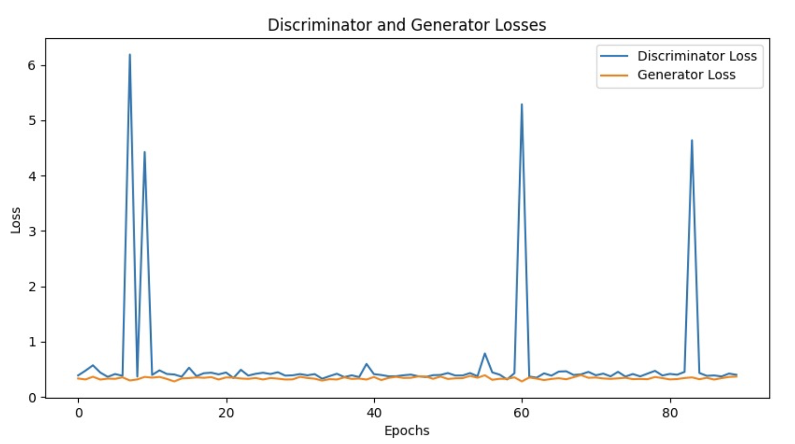
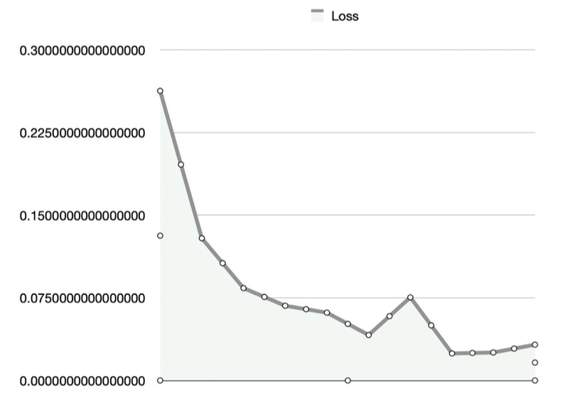
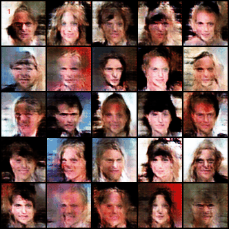
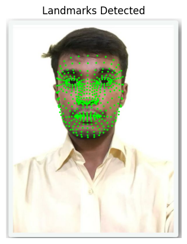

# Deepfake Generation and Detection

🎭 *An AI-powered project for generating and detecting deepfake media using GANs and CNNs.*

---

## 📌 Project Overview
This project addresses the growing challenges posed by deepfakes through two main components:

1. **Deepfake Generation**  
   - Utilizes a custom GAN-based architecture to generate synthetic human faces.
   - Implements face-swapping techniques to create deepfake videos.

2. **Deepfake Detection**  
   - Employs a CNN-based classifier (ResNet18) to detect real vs fake media.
   - Trained on publicly available Real/Fake datasets for high accuracy.

The aim is to demonstrate both the creation and detection of deepfakes for **research and educational purposes only**.

---

## 📸 Outputs & Visualizations
### ✅ GAN Training Progress  

### ✅ CNN Training Progress  

### ✅ Generated Faces  

### ✅ Facial Landmark Detection  

---

## 📊 Key Results
| Component             | Dataset             | Performance |
|----------------------|---------------------|-------------|
| **GAN (Generation)** | CelebA             | ~76% |
| **ResNet18 (Detection)** | Real/Fake Dataset   | ~97% Accuracy |

---

## 🛠 Tech Highlights
- **GAN** for synthetic image generation
- **Face-swapping** using affine transforms
- **CNN (ResNet18)** for fake detection
- Libraries: *PyTorch, OpenCV, Mediapipe, NumPy, Matplotlib*

---

## 🌟 Future Scope
- Enhance GAN for higher-resolution outputs
- Train detection model on larger, more diverse datasets
- Implement **video-based detection** with temporal consistency
- Real-time detection in streaming platforms

---

## 📜 Disclaimer
This project is for **educational and research purposes only**. Any misuse for malicious activities is strictly prohibited.
